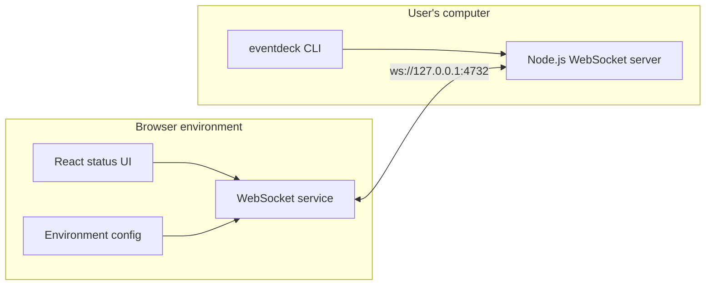
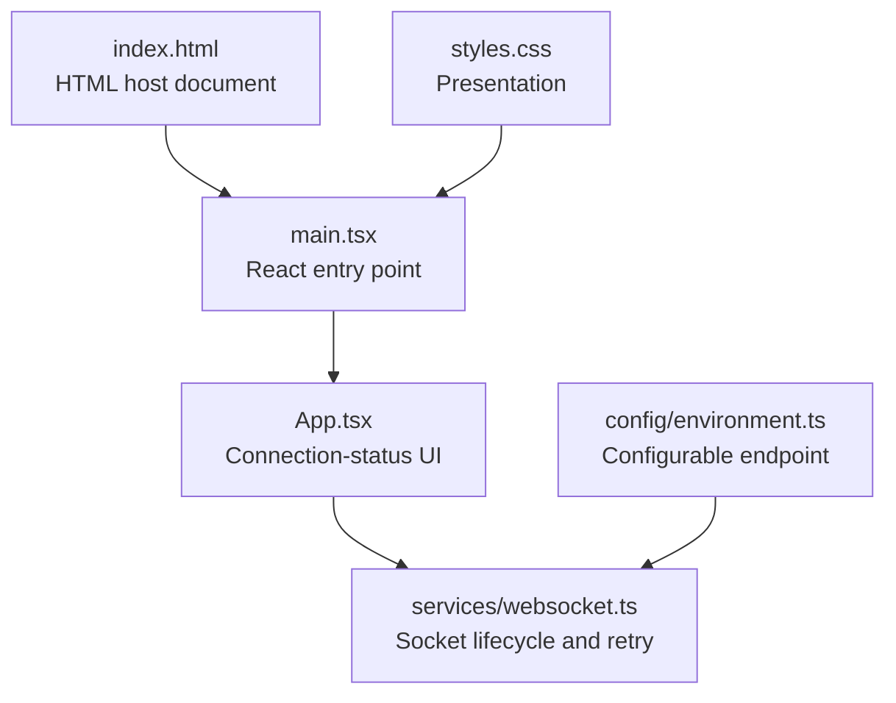
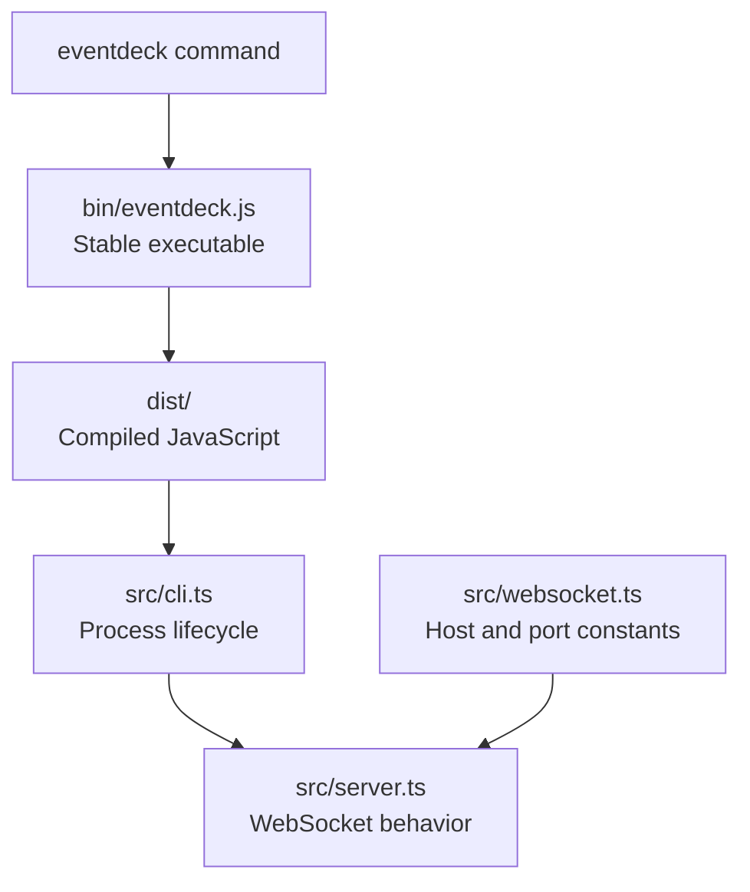
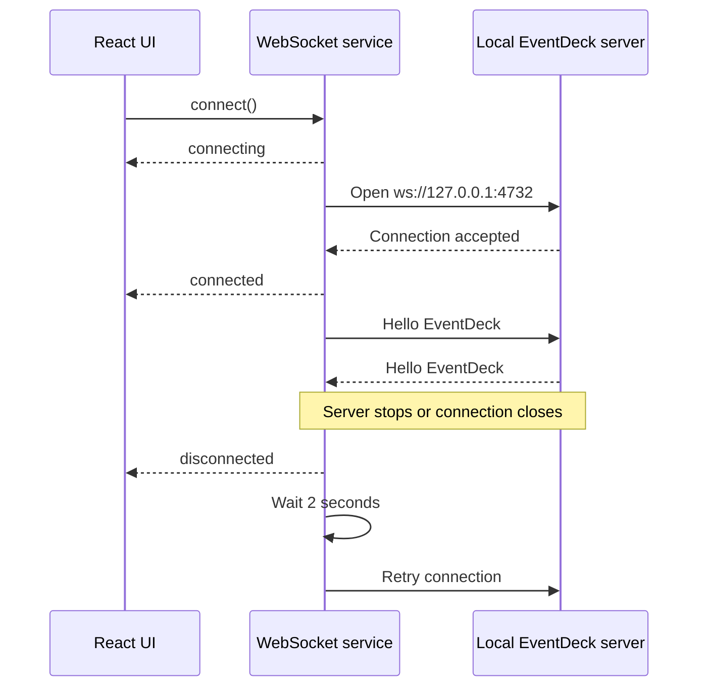
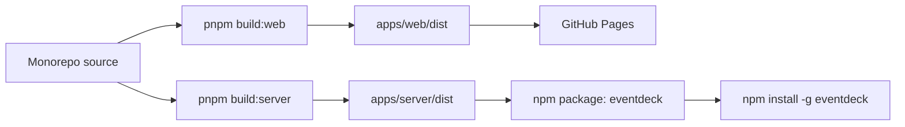

# EventDeck

EventDeck is a small pnpm monorepo containing two applications:

- **Web** — a React page that reports whether the browser can reach the local EventDeck server.
- **Server** — a local Node.js WebSocket echo server distributed through npm as `eventdeck`.

The current version is intentionally a foundation rather than the complete EventDeck product. It verifies the browser-to-local-server connection before dashboards, event processing, persistence, and other product features are introduced.

## Project architecture

EventDeck uses a **two-application monorepo architecture**. The repository is managed as one pnpm workspace, but the browser application and local server remain separate packages with different runtime, build, and release responsibilities.

### Architecture at a glance



The browser never imports server code, and the server never contains frontend code. Their only runtime relationship is the WebSocket connection.

### Architectural layers

#### 1. Workspace layer

The repository root coordinates all applications:

```text
Root package.json
      │
      ├── starts/builds apps/web
      ├── starts/builds apps/server
      └── type-checks the complete workspace

pnpm-workspace.yaml
      └── discovers packages under apps/*

pnpm-lock.yaml
      └── locks dependencies for reproducible installs
```

The root package is marked `private` because it is only an orchestration layer. It must never be published accidentally. The publishable npm package lives in `apps/server`.

#### 2. Web application layer

`apps/web` runs in the browser and contains only browser-facing concerns:



Responsibilities are separated deliberately:

- **Presentation:** `App.tsx` converts connection state into visible text.
- **Transport:** `services/websocket.ts` creates the socket, handles events, sends the echo message, and reconnects.
- **Configuration:** `config/environment.ts` owns the endpoint and supports environment overrides.
- **Build:** Vite converts the React source into static files under `apps/web/dist`.

This means a future UI redesign does not need to rewrite connection handling. Likewise, a future transport change can be isolated to the service and configuration layers.

#### 3. Local server layer

`apps/server` runs as a local Node.js process and is also the source of the public `eventdeck` npm package:



The server is split into three concerns:

- **CLI/process lifecycle:** starts the service, prints status, catches startup errors, and handles `Ctrl+C` or termination signals.
- **Server lifecycle:** opens and closes the WebSocket server and echoes messages.
- **Network configuration:** defines `127.0.0.1`, port `4732`, and the full WebSocket URL in one place.

The small JavaScript file under `bin` is kept stable for npm while the implementation is compiled from TypeScript into `dist`. Users therefore execute production JavaScript rather than TypeScript source.

#### 4. Communication layer

The web and server communicate using a direct WebSocket connection:



The echo message is a minimal protocol check. It proves that the browser can both send to and receive from the local process, rather than merely opening a socket.

#### 5. Build and delivery layer

The two applications have independent delivery paths:



- The web build is static and can be hosted without a Node.js server.
- The server build is packaged separately and runs on the user's computer.
- A web-only release does not require a new npm server version.
- A server release can be versioned using Semantic Versioning without redeploying the website.

### Why this architecture?

#### Why use a monorepo?

The website and server belong to the same product and evolve together. A pnpm monorepo gives them:

- one repository and review history;
- one dependency lockfile;
- consistent root-level commands;
- atomic changes when a browser/server contract evolves;
- independent package boundaries and deployment targets.

Separate repositories would add coordination overhead before the project needs it. A single combined package would couple browser dependencies, Node.js dependencies, builds, and releases unnecessarily.

#### Why keep the web and server independent?

They run in different environments. The web application runs inside browser security rules and deploys as static assets. The server runs with Node.js on the user's machine and is installed through npm. Separate packages prevent runtime-specific dependencies and configuration from leaking across that boundary.

#### Why use a service for WebSocket communication?

React components should describe UI, not manage low-level socket events and retry timers. Centralizing communication provides one connection lifecycle, makes later protocol changes easier, and prevents `new WebSocket(...)` from spreading throughout the interface.

#### Why bind only to `127.0.0.1`?

EventDeck is currently a local companion process. Binding to the loopback interface allows applications on the same computer to connect without exposing the server to other devices on the network.

#### Why is there no shared package?

There is not enough shared domain code yet. Adding `packages/shared` now would create build and dependency overhead for only a few constants. A shared protocol package should be introduced when both applications need substantial common message types, validation schemas, or versioned protocol definitions.

### Architecture boundaries for future development

Future work should follow these ownership rules:

- UI components and browser state belong in `apps/web/src`.
- Browser networking belongs in `apps/web/src/services`.
- Environment-dependent browser values belong in `apps/web/src/config`.
- CLI flags and terminal output belong in `apps/server/src/cli.ts`.
- Local server behavior belongs in `apps/server/src/server.ts` or focused server modules.
- Shared packages should be created only when real cross-application code exists.

These boundaries allow the product to grow without forcing another repository-level restructure.

## Connection behavior

When the web page loads, it connects to:

```text
ws://127.0.0.1:4732
```

The page moves through these states:

- `Connecting with EventDeck...` while opening the connection.
- `Connected with EventDeck` after the socket opens.
- `Not connected with EventDeck` when the connection fails or closes.

After a disconnect, the client retries every two seconds. When connected, it sends `Hello EventDeck`; the server returns the same message, and the browser logs the echo response in its developer console.

The server binds only to `127.0.0.1`, not `0.0.0.0`, because it is designed to be accessed from the same computer and should not be unnecessarily exposed to the local network.

## Project structure

```text
eventdeck/
├── apps/
│   ├── web/
│   │   ├── public/
│   │   ├── src/
│   │   │   ├── config/environment.ts
│   │   │   ├── services/websocket.ts
│   │   │   ├── App.tsx
│   │   │   ├── main.tsx
│   │   │   ├── styles.css
│   │   │   └── vite-env.d.ts
│   │   ├── index.html
│   │   ├── package.json
│   │   ├── tsconfig.json
│   │   └── vite.config.ts
│   └── server/
│       ├── bin/eventdeck.js
│       ├── src/
│       │   ├── cli.ts
│       │   ├── server.ts
│       │   └── websocket.ts
│       ├── package.json
│       └── tsconfig.json
├── .github/workflows/deploy-web.yml
├── .gitignore
├── package.json
├── pnpm-lock.yaml
├── pnpm-workspace.yaml
└── README.md
```

## File guide

### Root files

- **`package.json`** — marks the repository as private and provides common commands for developing, type-checking, and building both applications. The public npm package is defined separately under `apps/server`.
- **`pnpm-workspace.yaml`** — registers `apps/*` as workspace packages and allows the required `esbuild` installation step.
- **`pnpm-lock.yaml`** — records exact dependency versions for reproducible local and CI installations. It is generated and maintained by pnpm.
- **`.gitignore`** — excludes dependencies, compiled output, TypeScript build metadata, logs, package archives, and local pnpm data.
- **`README.md`** — documents the architecture, development workflow, builds, packaging, and deployment.

### Web files

- **`apps/web/package.json`** — defines the private web package, React/Vite dependencies, and its `dev`, `build`, and `typecheck` scripts.
- **`apps/web/index.html`** — provides the HTML document and the `#root` element where React mounts.
- **`apps/web/vite.config.ts`** — configures React support and uses `/eventdeck/` as the production asset base for GitHub Pages. Development continues to use `/`.
- **`apps/web/tsconfig.json`** — supplies strict browser and React TypeScript settings.
- **`apps/web/public/.gitkeep`** — keeps the currently empty public-assets directory in Git. Future static files can be placed there.
- **`apps/web/src/main.tsx`** — browser entry point that loads the stylesheet and renders the React application.
- **`apps/web/src/App.tsx`** — minimal presentation component that starts the client and renders the current connection status.
- **`apps/web/src/styles.css`** — visual styling for the status page and its connected, disconnected, and connecting states.
- **`apps/web/src/config/environment.ts`** — central source for the WebSocket endpoint. `VITE_EVENTDECK_WEBSOCKET_URL` can override its default value.
- **`apps/web/src/services/websocket.ts`** — owns WebSocket creation, event handling, the echo test, cleanup, and automatic reconnection.
- **`apps/web/src/vite-env.d.ts`** — loads Vite's TypeScript declarations, including support for `import.meta.env`.
- **`apps/web/dist/`** — generated static production output. It is created by the build and is not committed.

### Server files

- **`apps/server/package.json`** — defines the publishable `eventdeck` npm package, package metadata, included files, dependencies, and CLI mapping.
- **`apps/server/tsconfig.json`** — compiles strict Node.js TypeScript from `src` into ESM JavaScript under `dist`.
- **`apps/server/bin/eventdeck.js`** — executable npm entry point. It has a Node shebang and loads the compiled CLI.
- **`apps/server/src/cli.ts`** — starts the server, prints its status, reports startup errors, and handles graceful `SIGINT`/`SIGTERM` shutdown.
- **`apps/server/src/server.ts`** — creates the WebSocket server, echoes text or binary messages, and exposes explicit `start()` and `close()` lifecycle methods.
- **`apps/server/src/websocket.ts`** — centralizes the local host, port `4732`, and complete WebSocket URL.
- **`apps/server/dist/`** — generated JavaScript, declarations, and source maps used by the published CLI. It is created by the build and is not committed.

### Automation

- **`.github/workflows/deploy-web.yml`** — installs dependencies, builds only the web application, uploads `apps/web/dist`, and deploys it to GitHub Pages after a push to `main`.

## Requirements

- Node.js 20 or newer
- pnpm 11 or newer

Confirm the installed versions with:

```bash
node --version
pnpm --version
```

## Install the project

From the repository root:

```bash
pnpm install
```

This installs dependencies for the root workspace and both applications using `pnpm-lock.yaml`.

## Run the project locally

The web and server are separate processes, so run them in two terminals.

### Terminal 1: start the server

```bash
pnpm dev:server
```

Expected output includes:

```text
EventDeck

✓ Local server started
✓ WebSocket ready
✓ Listening on ws://127.0.0.1:4732
```

### Terminal 2: start the web application

```bash
pnpm dev:web
```

Open the local URL printed by Vite, normally `http://localhost:5173`.

With the server running, the page displays:

```text
Connected with EventDeck
```

Stop the server with `Ctrl+C`. The page should automatically change to:

```text
Not connected with EventDeck
```

Start the server again, and the reconnect loop should restore the connected state without refreshing the page.

### Verify the echo test

With both applications running:

1. Open the browser developer tools.
2. Select the **Console** tab.
3. Reload the page or wait for a connection.
4. Confirm the following messages appear:

```text
WebSocket connected
Echo response: Hello EventDeck
```

## Environment configuration

The default WebSocket endpoint is `ws://127.0.0.1:4732`. To test another endpoint, set the Vite environment variable before starting or building the web application:

```bash
VITE_EVENTDECK_WEBSOCKET_URL=ws://127.0.0.1:5000 pnpm dev:web
```

The server itself currently uses the fixed, centralized port `4732`.

## Type-check and build

Type-check both applications:

```bash
pnpm typecheck
```

Build both applications:

```bash
pnpm build
```

Build only the web application:

```bash
pnpm build:web
```

Output:

```text
apps/web/dist
```

Build only the server:

```bash
pnpm build:server
```

Output:

```text
apps/server/dist
```

The npm CLI always runs compiled JavaScript; it does not execute TypeScript source in production.

## Test the npm package locally

Build and create the package archive:

```bash
pnpm build:server
cd apps/server
npm pack
```

This creates a file such as `eventdeck-1.0.0.tgz`. Install and run it globally:

```bash
npm install -g ./eventdeck-1.0.0.tgz
eventdeck
```

Run `pnpm dev:web` from the repository root and confirm that the page connects to the globally installed server.

After testing, stop the server and uninstall the package:

```bash
npm uninstall -g eventdeck
```

## Publish the server package

Publishing is intentionally manual and is not part of the build or deployment workflow:

```bash
cd apps/server
npm login
pnpm build
npm pack
npm publish
```

Once published, users can install and start it with:

```bash
npm install -g eventdeck
eventdeck
```

## GitHub Pages deployment

Pushes to `main` trigger `.github/workflows/deploy-web.yml`. The workflow deploys only the static web build; the Node.js server is never deployed to GitHub Pages.

The initial production URL is expected to be:

```text
https://manishsharma130.github.io/eventdeck/
```

Because that page uses HTTPS while the local server initially uses `ws://`, browsers may block the connection as mixed content or apply loopback/private-network restrictions. The transport is isolated in `services/websocket.ts` so a secure solution can be introduced later without rewriting the UI. No certificate or `wss://` workaround is included in this initial foundation.

## Future growth

New product features should preserve the current boundaries:

- React components belong in `apps/web/src`.
- Browser communication belongs in web services rather than UI components.
- Local server features belong in `apps/server/src`.
- Shared packages should be created only when real shared schemas or utilities appear.

This allows EventDeck to grow into a full application without another repository-level restructuring.
