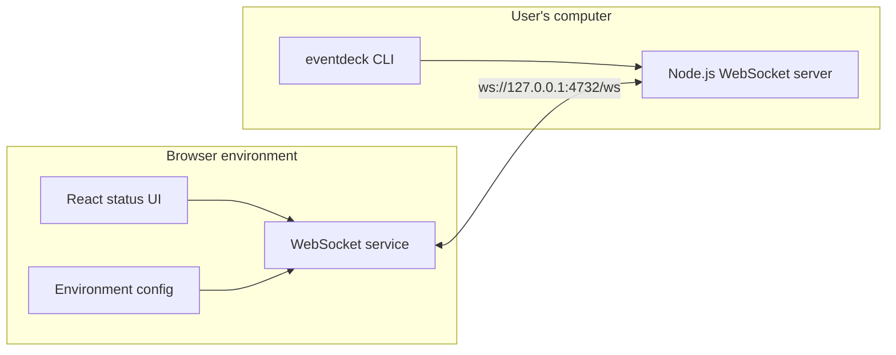
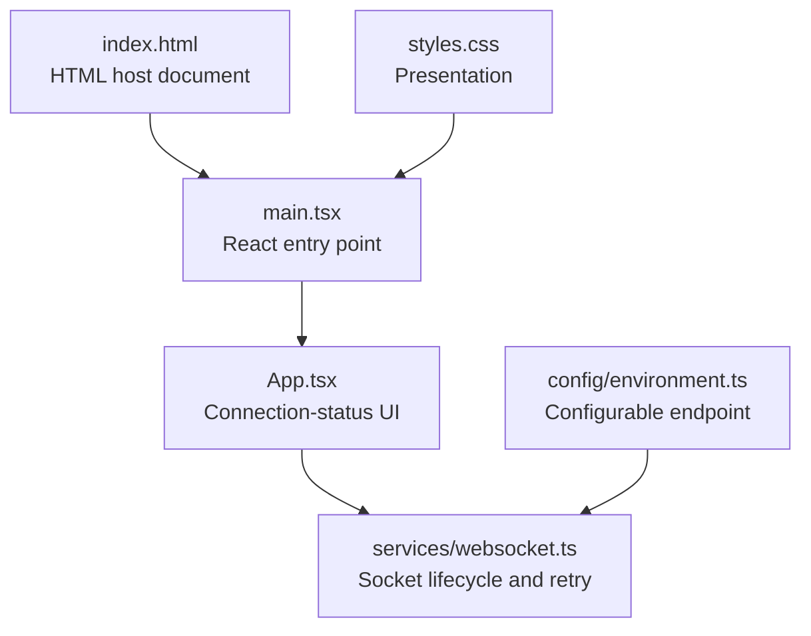
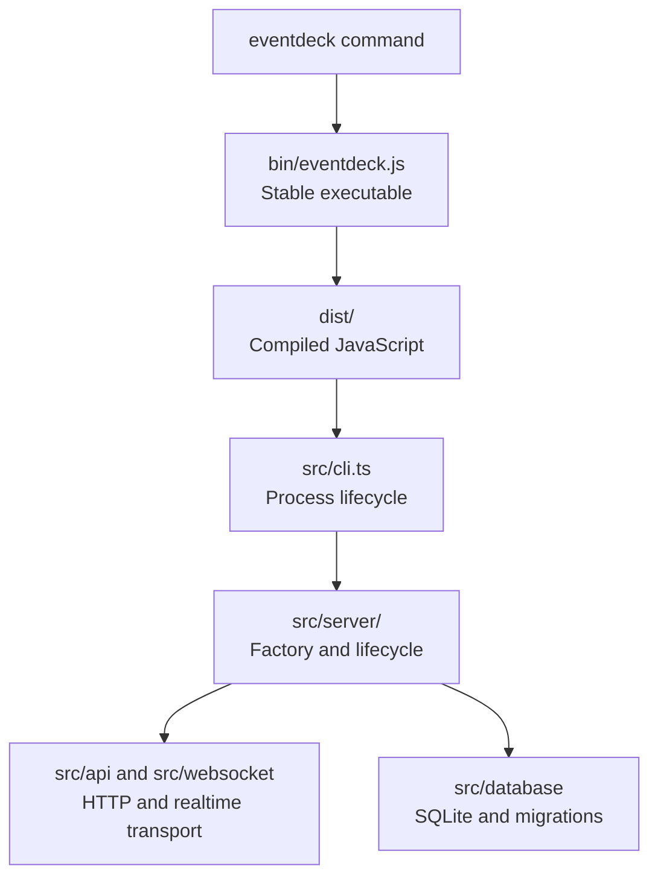
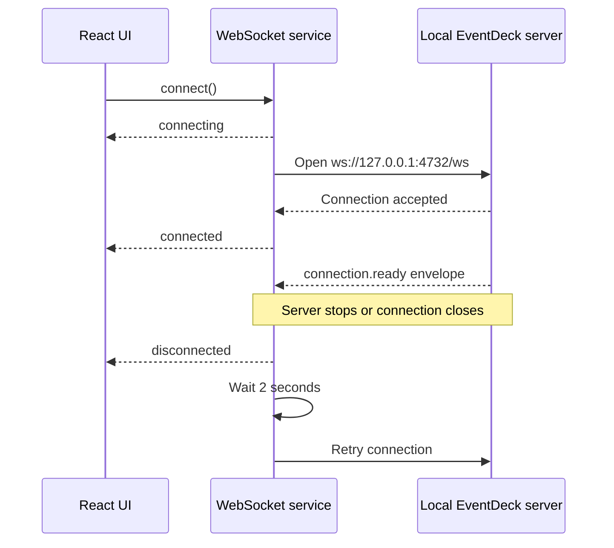
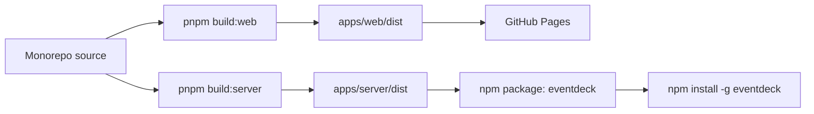

# EventDeck architecture

[← Back to README](../README.md) · [Server setup](server-foundation-setup.md) · [File reference](file-reference.md) · [Development guide](development.md) · [Deployment](deployment.md)

## Architecture overview

EventDeck uses a **two-application monorepo architecture**. One pnpm workspace contains a browser application and a local server, but each application owns its runtime dependencies, build configuration, and delivery process.



The browser never imports server code, and the server never contains frontend code. Their only runtime relationship is the WebSocket connection.

## Application layers

### Workspace layer

The repository root coordinates both applications:

```text
package.json
    ├── starts and builds apps/web
    ├── starts and builds apps/server
    └── type-checks the complete workspace

pnpm-workspace.yaml
    └── discovers packages under apps/*

pnpm-lock.yaml
    └── locks dependencies for reproducible installs
```

The root package is private because it is only an orchestration layer. The publishable npm package is defined independently in `apps/server`.

### Web application layer

`apps/web` contains browser-facing concerns only:



- **Presentation:** `App.tsx` converts connection state into visible text.
- **Transport:** `services/websocket.ts` creates the socket, handles versioned events, and reconnects.
- **Configuration:** `config/environment.ts` owns the endpoint and supports environment overrides.
- **Build:** Vite converts the React source into static files under `apps/web/dist`.

A future UI redesign therefore does not need to rewrite connection handling. A future transport change can remain isolated to the service and configuration layers.

### Local server layer

`apps/server` runs as a local Node.js process and produces the public `eventdeck` npm package:



- **CLI lifecycle:** starts the service, prints status, catches errors, and handles `Ctrl+C` or termination signals.
- **Server lifecycle:** composes dependencies, starts Fastify, and cleanly closes WebSocket clients and SQLite.
- **Transport:** exposes `/health`, `/api/status`, and `/ws`; WebSocket messages use a versioned envelope.
- **Persistence:** configures SQLite pragmas and runs migrations without creating feature tables.

The stable JavaScript file under `bin` loads compiled output from `dist`, so npm users run production JavaScript rather than TypeScript source.

## Runtime communication



The ready envelope proves that the browser can receive the standardized realtime protocol from the local process.

## Build and delivery architecture



- The web build is static and does not need a hosted Node.js server.
- The server build runs locally and is distributed through npm.
- A web-only release does not require a new npm package version.
- Server releases can follow Semantic Versioning without redeploying the website.

## Why this architecture?

### Why use a monorepo?

The applications belong to the same product and will evolve together. A pnpm monorepo provides one repository, one dependency lockfile, consistent root commands, and atomic changes when the browser/server contract evolves. At the same time, workspace package boundaries preserve independent dependencies and releases.

Separate repositories would add coordination overhead too early. One combined application package would instead couple browser dependencies, Node.js dependencies, builds, and releases.

### Why keep the web and server independent?

They run in different environments. The web application operates under browser security rules and deploys as static assets. The server runs with Node.js on the user's computer and is installed through npm. Separate packages prevent runtime-specific code and dependencies from leaking across this boundary.

### Why isolate WebSocket communication?

React components should describe UI rather than manage socket events and retry timers. One WebSocket service provides a single connection lifecycle and prevents `new WebSocket(...)` calls from spreading throughout the interface.

### Why bind to `127.0.0.1`?

EventDeck is a local companion process. Binding to the loopback interface allows software on the same computer to connect without exposing the server to other devices on the network.

### Why is there no shared package?

There is not enough shared domain code yet. A premature `packages/shared` would add build and dependency overhead for a few constants. It should be introduced when both applications need substantial common schemas, protocol messages, or validation logic.

## Future architecture boundaries

- UI components and browser state belong in `apps/web/src`.
- Browser networking belongs in `apps/web/src/services`.
- Browser environment values belong in `apps/web/src/config`.
- CLI flags and terminal output belong in `apps/server/src/cli.ts`.
- Local server behavior belongs in focused modules under `apps/server/src`.
- Shared packages should be introduced only for real cross-application code.

These boundaries allow EventDeck to grow without another repository-level restructure.
