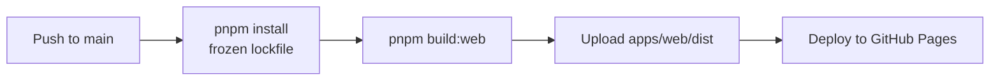

# Web deployment

[← Back to README](../README.md) · [Architecture](architecture.md) · [File reference](file-reference.md) · [Development guide](development.md)

## GitHub Pages workflow

Pushes to `main` trigger `.github/workflows/deploy-web.yml`:



Only the static web application is deployed. The local Node.js server is never uploaded to GitHub Pages.

The initial production URL is expected to be:

```text
https://manishsharma130.github.io/eventdeck/
```

Vite uses `/eventdeck/` as its production base, ensuring JavaScript and CSS assets resolve correctly when the site is hosted below the repository path rather than at `/`.

## HTTPS and the local WebSocket server

The hosted page uses HTTPS while the initial local endpoint uses:

```text
ws://127.0.0.1:4732
```

Browsers may block this connection as mixed content or apply loopback/private-network access restrictions. This behavior can differ between browser versions and security configurations.

The transport is isolated in `apps/web/src/services/websocket.ts`, and the endpoint is isolated in `apps/web/src/config/environment.ts`. A future secure solution can therefore be introduced without rewriting UI components.

No local certificate, `wss://` server, browser extension, or alternate bridge is included in the current foundation.

## Future custom domain

A custom domain is intentionally not configured yet. When one is introduced, the web build's base-path and hosting configuration can be updated without changing the server package architecture.
